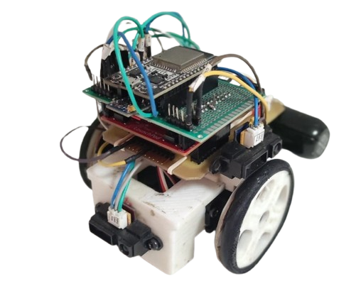

# Desarrollo de aplicaciones/sistemas con microbots basados en TIVA 

El presente proyecto consiste en la implementación de la capacidad de resolver un laberinto por parte del microbot. Siendo éste capaz de ser manejado y monitorizado de forma remota a través de una aplicación implementada en el entorno gráfico Qt.

## Funcionamiento
- **Modo Manual:** El usuario controla el microbot a través de la botonera proporcionada en la aplicación.
- **Modo Automático:** Destinado para la resolución del laberinto. El microbot pone en funcionamiento la lógica de navegación implementada y monitoriza su entorno y recorrido en la aplicación, desde la cual se inicia, detiene o resetea dicha lógica. 

## Vista del microbot

## Vista de la aplicación

